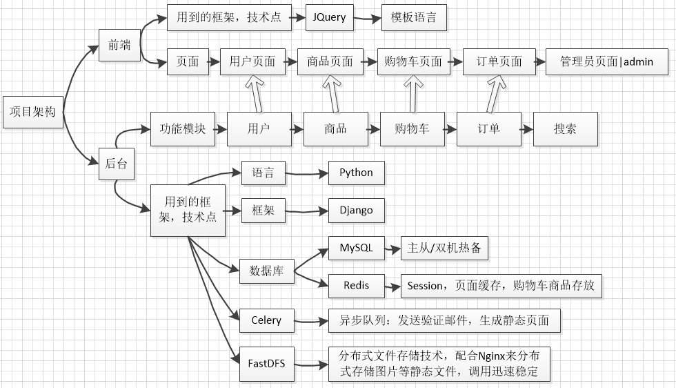
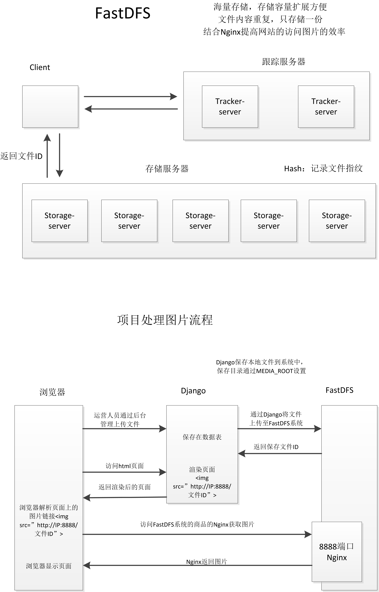
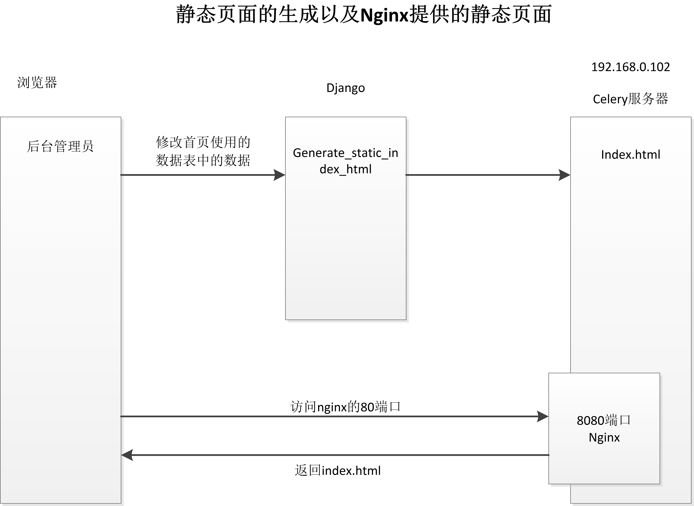
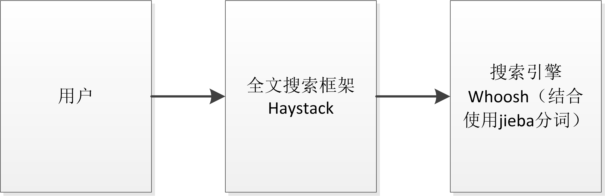

# MyDailyFresh

## 项目展示
项目分析：
[系统架构](readme/Analysis.md)

项目图片展示：
[系统架构](readme/show.md)

## 项目框架

## 数据库表结构

**Django的ORM数据库表字段生成和主外键约束关系**

除了基本的字段之外，每个表模型继承三个基础字段：创建时间，更新时间，是否删除。
## 用户验证模块

## 类视图

## 用户模块
1、使用的是Django的用户认证系统，主要的认证方法有：
|方法名|备注|
|--|--|
|create_user|创建用户|
|authenticate|登录验证|
|login|记录登录状态|
|logout|退出用户登录|
|is_authenticated|判断用户是否登录|
|login_required装饰器|进行登录判断|

2、邮件发送激活用户

## 商品模块
1、FastDFS分布式文件存储系统框架以及应用到项目中

2、购物车数据处理

- 1、用户添加：当用户点击商品加入购物车的时候需要添加购物车的记录。
- 2、用户获取：用户在访问购物车页面的时候获取用户的购物车的记录
- 3、数据的保存形式：使用redis的hash类型保存，每个用户的购物车记录用一条数据保存：hash：cart_用户id：{'sku_id1':数量，'sku_id2':数量}
- 4、获取用户购物车的商品的条数：使用hlen统计hash中元素的数量。

3、网站性能优化：页面静态化和缓存
- ①使用celery生成静态页面

- ②使用redis作为页面数据缓存
    - 把页面用到的数据缓存起来，如果使用到这些数据的时候，先从缓存中获取，如果获取不到，再去查询数据库
    - 需要注意的是管理员在后台修改了首页上面的数据表里面的信息的时候，需要更新缓存数据
- ③ 网站本身体性能的优化，减少数据库的查询的次数，防止恶意的攻击。例如DDOS攻击

4、商品的搜索：全文检索框架

可以极大提高对数据库的模糊搜素的时间损耗，最后改变分词的方式，使用结巴分词之后可以提高搜索的精度。

## 购物车模块
1、明确要点：
- 确定前端是否传递数据，传递什么数据，什么格式的数据
- 确定前端访问的方式（get，post）
- 确定返回给前端的是什么数据，什么格式

2、经典的购物车前端页面，使用JQuery操作页面元素进行显示

## 订单模块
1、MySQL的事务：一组mysql语句，要么执行，要么全不执行。

2、MySQL的事务特点之隔离性：Repeatable Read可重复读（MySQL独特），Django2.x之后在连接数据库时，直接修改为Read Committed（读取提交内容），MySQL8.x之后修复了幻读bug。

3、锁概念：
- 悲观锁：冲突比较多的时候使用
- 乐观锁：冲突比较少的时候使用

4、订单支付：对接支付宝流程

## 项目部署
部署流程图：

部署流程已经放上了博客：
https://blog.csdn.net/ATOOHOO/article/details/100105142

